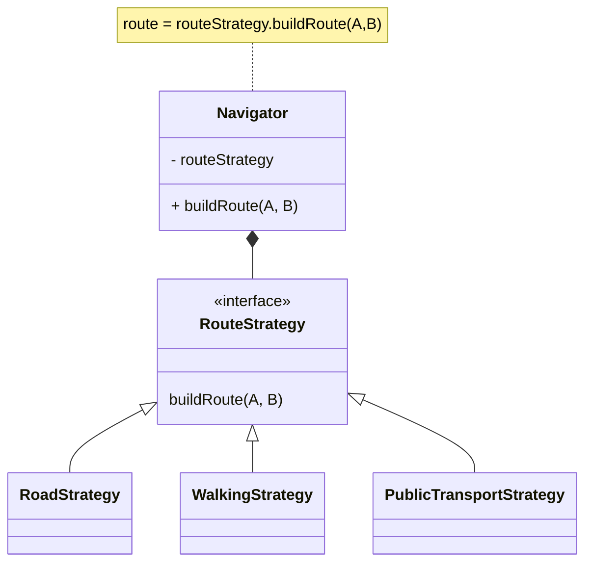

# Strategy Design Pattern  

**Date:** 2024-12-26  
**Tags:** [[Behavioral Design Patterns]]

## Pattern Name  
-  Strategy Design Pattern

## Category  
- Behavioral  

## Intent  
- What does this pattern solve?  
	In my opinion it solves the issue of having too many if conditions that can be grouped, as an example it might be a condition related to many products which can be grouped into categories and each category has the same set of rules.
	**Note** : The line between the rule design pattern and strategy design pattern is a very thin line, as a way to differentiate both of them:
		If the rule is coupled tightly with a class attribute then use strategy, if it's related to a composed attribute, then use rule
	The rule is still a #child rule, meaning that it's not widely tested yet 
## Applicability  
- When to use it?  
	 too many if conditions
## Participants  
- Key components involved:  

## Structure  
- Diagram or explanation of the pattern's structure.  

## Implementation Steps  
1.  Assume we're having the navigator class that will have a navigation strategy wither it's walking, road or public transportation 
2.  we will compose an interface of routing into the navigator this will assure the decoupling between the navigator and the routing strategy
3.  make concretes of Route strategy as much as you want, this will assure that whenever you want to add a new strategy you won't have the headache of adjusting the whole code 

## Real-World Examples
You're having an e-commerce that has many skus, each sku has a sell-in and quality attributes, each day these values change based on the product, as an example, if the product is samsung S23 then it's quality won't change neither it's sell in however if the product is xaomi then it's quality will decrease twice as much 

## Notes:
Having many if conditions? it's strategy pattern situation.