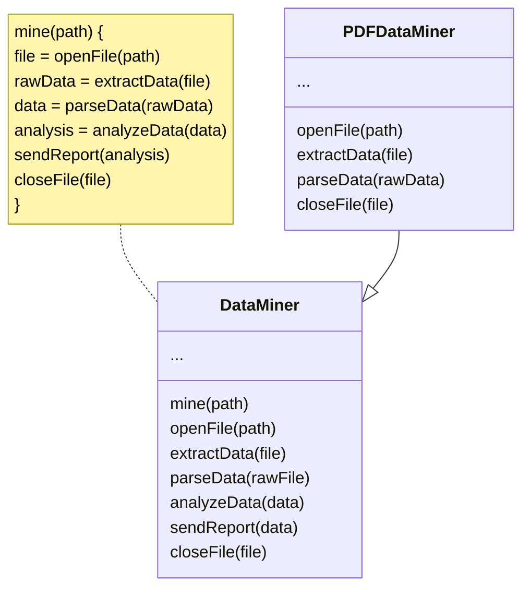

# Template Method Design Pattern  

**Date:** 2024-12-31  
**Tags:** [[Behavioral Design Patterns]] [[Design Patterns]]

## Pattern Name  
-  Template Method Design Pattern  

## Category  
- Behavioral  

## Intent  
- What does this pattern solve?  
what pattern solves is the issue of having a multiple classes that shares a set of operations all in specific order, this will lead to code duplication which violates the DRY principle making the maintainability causes a headache along with the extensibility.  
## Applicability  
- When to use it?  
whenever you have a multiple classes shares in a set of operations in a specific order e.g.: a date miner that fetches data from PDF, CSV and image files.
all will have the same functions of reading files, analyzing and exporting data.
## Participants  
- Key components involved:  
	- abstract class that holds the shared set of operations.
	- each class the extends that base abstract class

## Structure  
- Diagram or explanation of the pattern's structure.  

## Code Example  
[Github Link](https://github.com/ammargomaa1/design-patterns/tree/main/Patterns/Behavioral/TemplateMethod)

## Pros and Cons

### Pros:
- You can let clients override only certain parts of a large algorithm, making them less affected by changes that happen to other parts of the algorithm.
- You can pull the duplicate code into a superclass.

### Cons:
- Some clients may be limited by the provided skeleton of an algorithm.
- You might violate the _Liskov Substitution Principle_ by suppressing a default step implementation via a subclass.
- Template methods tend to be harder to maintain the more steps they have.

## Related Patterns
- [[Factory Design Pattern]] is a specialization of Template Method. At the same time, a _Factory Method_ may serve as a step in a large _Template Method_.
- Template Method is based on inheritance: it lets you alter parts of an algorithm by extending those parts in subclasses. [[Strategy Design Pattern]] is based on composition: you can alter parts of the object’s behavior by supplying it with different strategies that correspond to that behavior. _Template Method_ works at the class level, so it’s static. _Strategy_ works on the object level, letting you switch behaviors at runtime.